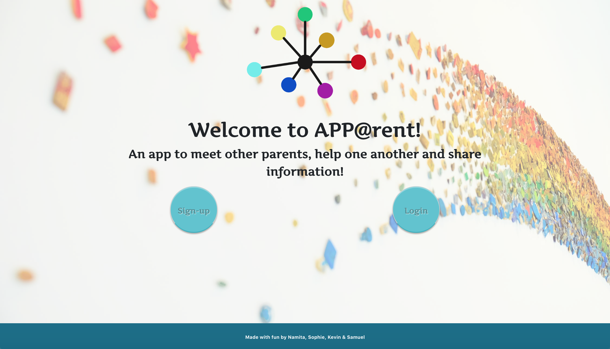

# APP@rent

<b><u>Summary:</u></b>  
In this project, we built APP@rent - an app for parents. Parenthood is great but let's face it, it can also be very challenging! The idea was then to create an app to help parents meet other parents, help one another, share tips, events....

Each parent creates a personal account by filling up a sign-up form and give some information about them (without being intrusive). Then, every parent can look through the "catalog" of members and connect with parents that live in the same area, whose kids go to the same school, have the same age… They can also share external events through the app and share tricks and tips (discounts on kid supplies, summer camp info, kid activities info, educational tips, donation of clothes, toys etc…).

<a href="http://www.apparent.ga:3000" target="_blank">Click me to check the app out!</a>

<h2>Version</h2>
This is the first version of APP@rent and it is a work in progress! The team is currently working hard to implement more functionalities, fix some bugs and improve the overall user's experience of every parent!
  

<h2>Technologies Used:</h2>
<li><b>S</b>equelize</li>
<li><b>E</b>xpress</li>
<li><b>R</b>eact</li>
<li><b>N</b>ode</li>
<li>HTML</li>
<li>CSS</li>
<li>Bootstrap</li>
<li>JavaScript</li>
<li>Media Queries</li>
  

<h2>
Screenshot of the landing Page
</h2>

<h2>
GIF showing the app in action
</h2>

# <a name="authors">Meet the Authors!</a>

| Author                                                                                                                                              | Summary                                                                                                                                                                                                                                                                                              | Fun Fact                                                                                                                                                    | Hobbies                                                                                |
| --------------------------------------------------------------------------------------------------------------------------------------------------- | ---------------------------------------------------------------------------------------------------------------------------------------------------------------------------------------------------------------------------------------------------------------------------------------------------- | ----------------------------------------------------------------------------------------------------------------------------------------------------------- | -------------------------------------------------------------------------------------- |
| <b>Samuel Yu :hatching_chick:  https://github.com/yusungsamuel | Samuel Yu comes from a background in chemistry and pharmacology. He is currently working on becoming a full stack web developer. His goal is to create an app that can make healthcare professional more accessible to patients.                                                                     | Samuel was a certified First Aid/CPR instructor and he has taught a First Aid/CPR class during CPR Saturday                                                 | league of legends, anime                                                               |
| <b>Kevin Choi :rice_ball:  https://github.com/kchoi123         | Kevin Choi comes from a background in IT Infrastructure specializing in hybrid system deployment using co-locations, AWS, Azure, Rackspace, and SoftLayer. His goal is to develop tools that will help collaborate hardware and software incompatibilities, both technologically and departmentally. | Kevin has played on the US Junior National Badminton Team.                                                                                                  | Netflix and sitting on the couch with his dog Polo :dog:                               |
| <b>Namita Shenai :koala:  https://github.com/NVK2016           | Namita comes from a background in Accounting with industry experience in IT. She has experience working on C# and SQL projects. Currently she is enrolled in UC Berkley Coding Bootcamp, learning new skills such as REACT, Node , Express & MongoDB.                                                                   | In her spare time she likes drawing rangolis & playing Kinect video games. **R**eading & story telling to my toddler is a talented acquired recently ;). | Binge watching shows on Netflix or Prime, practising my Caligraphy Skills |
| <b>Sophie Mallez :cat:  https://github.com/SophM               | Sophie's background is in Academic Research. She has spent the past 6 years working in population genetics and invasion biology, using DNA to identify the pattern of spread of invasive species.                                                                                                    | Sophie is a sock-addict and always wears funny or colorful socks!                                                                                           | Hiking, Backpacking, Cooking, Playing Tennis, Sewing, Surfing, Board Games             |
|                                                                                                                                                     |
